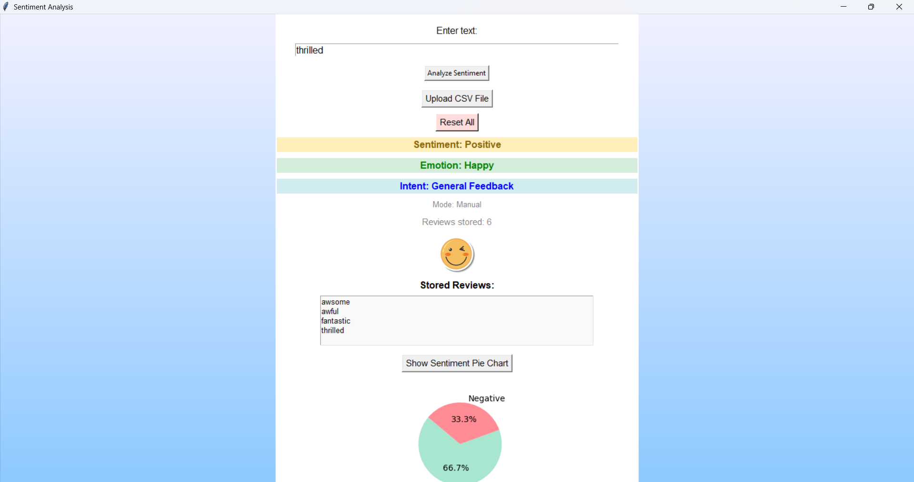

**Features of the project**

- 🔍 **Sentiment Detection** — Classifies text as Positive or Negative
- 🎭 **Emotion Display** — Shows 😊 or 😞 emoji based on sentiment
- 🎯 **Intent Detection** — Detects if the user intends to Purchase, Cancel, Recommend, or give General Feedback
- 📊 **Pie Chart Visualization** — Displays Positive vs Negative feedback in real-time
- 🗃 **Session Review History** — Stores and displays reviews from current session
- 🎨 **Stylish UI**— soft color themes, responsive feedback

**Project Overview:**
-This is a GUI-based Sentiment Analysis tool built using Python and Tkinter. It analyzes product reviews, detects user intent, and visualizes the results—all in a visually appealing and interactive interface.       Ideal for businesses looking to quickly interpret customer feedback.
- It allows user to upload **csv file** and generate a sentiment pie chart to tell percentage of negative and positive sentiment
-The project uses Navie Bayes classifier

  **i)Working of Project:**
  - Uses a pre-trained Machine Learning model to classify input text as Positive or Negative.
  - Applies keyword-based logic to detect user intent such as Purchase, Return/Cancel,   Recommendation, or Feedback.
  - Real-time pie chart displays overall sentiment distribution.
  
  **ii)Technology used**
  - Python
  - Tkinter (GUI)
  - Scikit-learn (Model)
  - Matplotlib (Charts)
  - Pillow (Image handling)
 
 **Model Detail:**
 - Algorithm: Multinomial Naive Bayes
 - Vectorizer: TfidfVectorizer
- Dataset: 16,000+ labeled product reviews
- Accuracy: ~91% on test data

Screenshot of the project:

